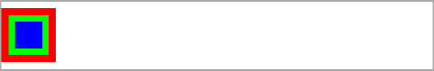
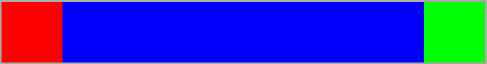
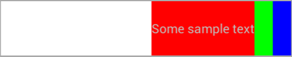

### SpringLayout - RelativeLayout on steroids.

#### Improvements compared to RelativeLayout

###### New attributes

**layout_alignCenterVertically:**

Align center of the view both vertically to the center of specified view. 

**layout_alignCenterHorizontally:**

Align center of the view both horizontally to the center of specified view. 

**layout_alignCenter:**

Align center of the view both vertically and horizontally to the center of specified view. 

        <!-- Center will be aligned horizontally. -->
        <attr name="layout_alignCenterHorizontally" format="reference" />
        <!-- Center will be aligned vertically. -->
        <attr name="layout_alignCenterVertically" format="reference" />

**_Example:_**



```
<org.coderoller.springlayout.SpringLayout xmlns:android="http://schemas.android.com/apk/res/android"
    xmlns:app="http://schemas.android.com/apk/res-auto"
    android:layout_width="match_parent"
    android:layout_height="50dp"
    android:background="@android:color/white">

    <View
        android:id="@+id/A"
        android:layout_width="40dp"
        android:layout_height="40dp"
        android:background="#ffff0000"
        android:layout_marginLeft="50dp"
        app:layout_centerVertical="true"/>

    <View
        android:id="@+id/B"
        android:layout_width="30dp"
        android:layout_height="30dp"
        android:background="#ff00ff00"
        app:layout_alignCenter="@id/A"/>

    <View
        android:id="@+id/C"
        android:layout_width="20dp"
        android:layout_height="20dp"
        android:background="#ff0000ff"
        app:layout_alignCenter="@id/B"/>

</org.coderoller.springlayout.SpringLayout>
```

**layout_relativeWidth:**

Specify the width of the view in percentage relative to parent width (excluding parent margins and padding).

**layout_relativeHeight:**

Specify the height of the view in percentage relative to parent height (excluding parent margins and padding).

**_Example:_**


```
<org.coderoller.springlayout.SpringLayout xmlns:android="http://schemas.android.com/apk/res/android"
    xmlns:app="http://schemas.android.com/apk/res-auto"
    android:layout_width="match_parent"
    android:layout_height="50dp"
    android:background="@android:color/white">

    <View
        android:id="@+id/A"
        android:layout_width="40dp"
        android:layout_height="40dp"
        android:background="#ffff0000"
        app:layout_centerInParent="true"
        app:layout_relativeWidth="75%"/>

    <View
        android:id="@+id/B"
        android:layout_width="30dp"
        android:layout_height="30dp"
        android:background="#ff00ff00"
        app:layout_alignCenter="@id/A"
        app:layout_relativeWidth="50%"/>

    <View
        android:id="@+id/C"
        android:layout_width="20dp"
        android:layout_height="20dp"
        android:background="#ff0000ff"
        app:layout_alignCenter="@id/B"
        app:layout_relativeWidth="25%"/>

</org.coderoller.springlayout.SpringLayout>
```

###### Detailed error messages

SpringLayout will throw an exception when you do something wrong.
For example it will inform you when you duplicate view constraints or introduce a circular dependancy.

###### Adapting width and height parameters

SpringLayout adapts view params a bit before rendering.
For example if you specify the view height to be match_parent, then it implies that layout_alignParentTop and layout_alignParentBottom parameters are true. This works both ways, so if layout_alignParentTop and layout_alignParentBottom parameters are true then view height will be match_parent.

The wrap_content parameter normally tells the SpringLayout to take the child desired size as the final one. However if you define both constraints in one axis for a view which has wrap_content size in that axis, then SpringLayout will expand that view to meet the contraints.

**_Example:_**



```
<org.coderoller.springlayout.SpringLayout xmlns:android="http://schemas.android.com/apk/res/android"
    xmlns:app="http://schemas.android.com/apk/res-auto"
    android:layout_width="match_parent"
    android:layout_height="wrap_content"
    android:background="@android:color/white">

    <View
        android:id="@+id/A"
        android:layout_width="40dp"
        android:layout_height="40dp"
        android:background="#ffff0000"
        app:layout_alignParentLeft="true"/>

    <View
        android:id="@+id/B"
        android:layout_width="40dp"
        android:layout_height="40dp"
        android:background="#ff00ff00"
        app:layout_alignParentRight="true"/>

    <View
        android:id="@+id/C"
        android:layout_width="wrap_content"
        android:layout_height="match_parent"
        android:background="#ff0000ff"
        app:layout_toRightOf="@id/A"
        app:layout_toLeftOf="@id/B"/>

</org.coderoller.springlayout.SpringLayout>
```


#### Springs

Springs introduced in SpringLayout slightly resemble Springs from GroupLayout that is available in Swing UI. They allow you to organize views on the screen in more advanced fashion without the need to nest layouts.

Let's say you want to center two Views horizontally on the screen. With RelatveLayout you would do something like this:

```
<RelativeLayout xmlns:android="http://schemas.android.com/apk/res/android"
    android:layout_width="match_parent"
    android:layout_height="60dp"
    android:background="@android:color/white">

    <LinearLayout
        android:layout_width="wrap_content"
        android:layout_height="match_parent"
        android:orientation="horizontal"
        android:layout_centerHorizontal="true">

        <TextView
            android:id="@+id/A"
            android:layout_width="wrap_content"
            android:layout_height="match_parent"
            android:text="@string/sample_text"
            android:background="#ffff0000"/>

        <View
            android:id="@+id/B"
            android:layout_width="20dp"
            android:layout_height="match_parent"
            android:background="#ff00ff00"/>
    </LinearLayout>

</RelativeLayout>
```

It works, but requires you to nest additional layout (that will only group those two views), which makes things slightly slower.
In SpringLayout you achieve the same by using Springs:


```
<org.coderoller.springlayout.SpringLayout xmlns:android="http://schemas.android.com/apk/res/android"
    xmlns:app="http://schemas.android.com/apk/res-auto"
    android:layout_width="match_parent"
    android:layout_height="60dp"
    android:background="@android:color/white">

    <org.coderoller.springlayout.Spring
        android:id="@+id/spring_A"
        android:layout_width="wrap_content"
        android:layout_height="wrap_content"/>

    <TextView
        android:id="@+id/A"
        android:layout_width="wrap_content"
        android:layout_height="match_parent"
        android:background="#ffff0000"
        android:text="@string/sample_text"
        android:gravity="center"
        app:layout_toRightOf="@id/spring_A"/>

    <View
        android:id="@+id/B"
        android:layout_width="20dp"
        android:layout_height="match_parent"
        android:background="#ff00ff00"
        app:layout_toRightOf="@id/A"/>

    <org.coderoller.springlayout.Spring
        android:id="@+id/spring_B"
        android:layout_width="wrap_content"
        android:layout_height="wrap_content"
        app:layout_toRightOf="@id/B"/>

</org.coderoller.springlayout.SpringLayout>

```

Spring is a lightweight View that does not take part in layout drawing.
Additionaly, Spring supports **layout_springWeight** attribute. It works similar to **layout_weight** attribute that can be found in LinearLayout, however **layout_springWeight** applies only to empty space. Every Spring has a default **layout_springWeight** of 1. So in the example above, the sum of spring weights in vertical axis is 2, therefore **spring_A** and **spring_B** will both take 1/2 of empty space left by views **A** and **B**.

**Please note:** 

Using Spring will internally introduce a chain of Views. In the example above we will have a horizontal chain consisting of views (in order): **spring_A**, **A**, **B**, **spring_B**. Based on that the SpringLayout knows that empty space available for Springs will be layout width minus **A** width and **B** width.

*Due to this fact, there are two things you have to keep in mind, when using Springs:*

- Springs are pointless (and won't work) when used inside a layout with wrap_content width or height (depends if the spring applies to vertical or horizontal chain), unless minWidth or minHeight parameter is specified. In other case empty space available to Springs will be always 0. 

- Currently the internal chains cannot divert, however this might change in future. This means that if you introduce a new view **C** that will be placed right of view **B**, then **spring_B** won't be attached to the chain since view *B* is succeeded by view **C** in the chain. So for the layout listed below the horizontal chain will consist of **spring_A**, **A**, **B**, **C**.

To illustrate:



```
<org.coderoller.springlayout.SpringLayout xmlns:android="http://schemas.android.com/apk/res/android"
    xmlns:app="http://schemas.android.com/apk/res-auto"
    android:layout_width="match_parent"
    android:layout_height="60dp"
    android:background="@android:color/white">

    <org.coderoller.springlayout.Spring
        android:id="@+id/spring_A"
        android:layout_width="wrap_content"
        android:layout_height="wrap_content"/>

    <TextView
        android:id="@+id/A"
        android:layout_width="wrap_content"
        android:layout_height="match_parent"
        android:background="#ffff0000"
        android:text="@string/sample_text"
        android:gravity="center"
        app:layout_toRightOf="@id/spring_A"/>

    <View
        android:id="@+id/B"
        android:layout_width="20dp"
        android:layout_height="match_parent"
        android:background="#ff00ff00"
        app:layout_toRightOf="@id/A"/>

    <View
        android:id="@+id/C"
        android:layout_width="20dp"
        android:layout_height="match_parent"
        android:background="#ff0000ff"
        app:layout_toRightOf="@id/B"/>
    
    <org.coderoller.springlayout.Spring
        android:id="@+id/spring_B"
        android:layout_width="wrap_content"
        android:layout_height="wrap_content"
        app:layout_toRightOf="@id/B"/>

</org.coderoller.springlayout.SpringLayout>

```

#### Attributes reference

##### Spring Layout

**minHeight**

Defines the minimum height of the layout. 

**minWidth**

Defines the minimum width of the layout. 

##### Spring Layout Children

**layout_toLeftOf**

Positions the right edge of this view to the left of the given anchor view ID.

**layout_toRightOf**

Positions the left edge of this view to the right of the given anchor view ID.

**layout_above**

Positions the bottom edge of this view above the given anchor view ID.

**layout_below**

Positions the top edge of this view below the given anchor view ID.

**layout_alignLeft**

Makes the left edge of this view match the left edge of the given anchor view ID.

**layout_alignTop**

Makes the top edge of this view match the top edge of the given anchor view ID.

**layout_alignRight**

Makes the right edge of this view match the right edge of the given anchor view ID.

**layout_alignBottom**

Makes the bottom edge of this view match the bottom edge of the given anchor view ID.

**layout_alignCenter**

Center will be aligned both horizontally and vertically with the given anchor view ID.

**layout_alignCenterHorizontally**

Center will be aligned horizontally with the given anchor view ID.

**layout_alignCenterVertically**

Center will be aligned vertically with the given anchor view ID.

**layout_alignParentLeft**

If true, makes the left edge of this view match the left edge of the parent.

**layout_alignParentTop**

If true, makes the top edge of this view match the top edge of the parent.

**layout_alignParentRight**

If true, makes the right edge of this view match the right edge of the parent.

**layout_alignParentBottom**

If true, makes the bottom edge of this view match the bottom edge of the parent. 

**layout_centerInParent**

If true, centers this child horizontally and vertically within its parent.

**layout_centerHorizontal**

If true, centers this child horizontally within its parent.

**layout_centerVertical**

If true, centers this child vertically within its parent.

**layout_relativeWidth**

Width relative to parent (in percents).

**layout_relativeHeight**

Height relative to parent (in percents).

**layout_springWeight**

Weight of the spring, 1 by default. Used to calculate how much of the empty space the Spring should take.
